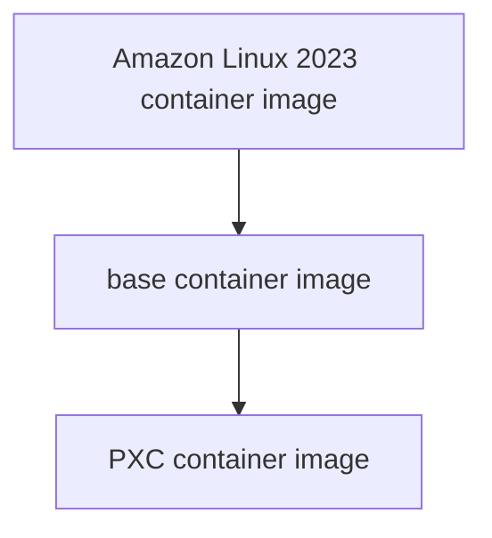

# Development environment

## Prerequisites

- Ensure you installed Docker on your machine. If not, please follow Docker's official documentation.[^1]
- Ensure you cloned the repository.

## Overview

In this setup, we are going to:
1. Write a Dockerfile for building a custom container image for Percona XtraDB Cluster (PXC).
2. Build the base and PXC container images.
3. Configure PXC.
4. Run PXC on three containers.

> [!IMPORTANT] 
> I strongly recommend relying on the Percona XtraDB Cluster's official documentation and support services [^2]. In this context, I offer a brief overview of the cluster setup with fundamental configurations.

## Write a Dockerfile

I have written two Dockerfiles, one for the base container image and another for the PXC container image, which already exist in the `docker` directory.

```bash
├── docker
│ ├── dockerfile.base.dev
│ └── dockerfile.pxc.8.0.35
```

For best practices,
- Install all the necessary software, including testing and debugging tools, in the base container image. This approach is applicable only for development (DEV) environments.
- Then install all the necessary software for Percona XtraDB Cluster in the PXC container image.

## Build the base and PXC container image

Here, I derive the base container image from the **Amazon Linux 2023** container image. Then, I create the PXC container image from the previously derived base container image.



**Step 1:** Switch to the `percona-xtradb-cluster` directory.

```bash
cd /opt/oss/percona-xtradb-cluster
```

**Step 2:** Download the required packages.

```bash
wget https://mirror.stream.centos.org/9-stream/BaseOS/x86_64/os/Packages/openldap-2.6.6-1.el9.x86_64.rpm -P docker/context/common
```
```bash
wget https://dl.fedoraproject.org/pub/epel/9/Everything/x86_64/Packages/q/qpress-20220819-1.el9.x86_64.rpm -P docker/context/common
```

**Step 3:** Download the RPM packages from their official website.

```bash
wget https://downloads.percona.com/downloads/Percona-XtraDB-Cluster-80/Percona-XtraDB-Cluster-8.0.35/binary/redhat/9/x86_64/percona-xtradb-cluster-icu-data-files-8.0.35-27.1.el9.x86_64.rpm -P docker/context/binary
```
```bash
wget https://downloads.percona.com/downloads/Percona-XtraDB-Cluster-80/Percona-XtraDB-Cluster-8.0.35/binary/redhat/9/x86_64/percona-xtradb-cluster-shared-8.0.35-27.1.el9.x86_64.rpm -P docker/context/binary
```
```bash
wget https://downloads.percona.com/downloads/Percona-XtraDB-Cluster-80/Percona-XtraDB-Cluster-8.0.35/binary/redhat/9/x86_64/percona-xtradb-cluster-client-8.0.35-27.1.el9.x86_64.rpm -P docker/context/binary
```
```bash
wget https://downloads.percona.com/downloads/Percona-XtraDB-Cluster-80/Percona-XtraDB-Cluster-8.0.35/binary/redhat/9/x86_64/percona-xtradb-cluster-server-8.0.35-27.1.el9.x86_64.rpm -P docker/context/binary
```

**Step 4:** Build the base container image.

```bash
docker image build -t pxc-base:dev -f docker/dockerfile.base.dev docker/context
```

**Step 5:** Build the PXC container image.  Suppose if you built separate base container image for production and named `pxc-base:prd`, you can use `--build-arg="ENV=prd"` flag to change the `ENV` arguments value in the `dockerfile.pxc.8.0.35`.

```bash
docker image build -t pxc:v8.0.35 -f docker/dockerfile.pxc.8.0.35 docker/context
```

## Configure Percona XtraDB Cluster

When running the cluster setup, it is crucial to maintain quorum for cluster stability. So, I am going to provision three nodes, each being a Docker container. I have already stored the configuration for each node in the `source/conf` directory.  You can get the configuration template from their official documentation [^3].

The `initialize.txt` file contains a MySQL ALTER statement that modifies the password for the `root` user to **root**.

```bash
├── source
│ ├── cert
│ └── conf
│     ├── initialize.txt
│     ├── node1.conf
│     ├── node2.conf
│     ├── node3.conf
```

I want encrypted replication traffic, so I need an SSL certificate. For the development (DEV) environment, I am creating an SSL certificate using the `openssl` tool based on their documentation [^4].  It is recommended to use the same SSL certificate for all the nodes in the cluster.

Let's generate an SSL certificates.

- Generate root CA private key and certificate.
```bash
openssl genrsa -out source/cert/ca-key.pem 2048
openssl req -new -x509 -nodes -days 3650 -key source/cert/ca-key.pem -out source/cert/ca.pem -subj "/CN=devopsplatform.tech"
```

- Generate MySQL server private key and certificate.

```bash
openssl req -newkey rsa:2048 -days 3600 -nodes -keyout source/cert/server-key.pem -out source/cert/server-req.pem -subj "/CN=pxc-cluster-server-node"
openssl rsa -in source/cert/server-key.pem -out source/cert/server-key.pem
openssl x509 -req -in source/cert/server-req.pem -days 3600 -CA source/cert/ca.pem -CAkey source/cert/ca-key.pem -set_serial 01 -out source/cert/server-cert.pem
```

- Generate MySQL client private key and certificate.

```bash
openssl req -newkey rsa:2048 -days 3600 -nodes -keyout source/cert/client-key.pem -out source/cert/client-req.pem -subj "/CN=pxc-cluster-client-node"
openssl rsa -in source/cert/client-key.pem -out source/cert/client-key.pem
openssl x509 -req -in source/cert/client-req.pem -days 3600 -CA source/cert/ca.pem -CAkey source/cert/ca-key.pem -set_serial 01 -out source/cert/client-cert.pem
```

## Run Percona XtraDB Cluster

It is considered good practice to store configuration settings in environment variables and inject these variable values from the shell into **Docker Compose** configuration at runtime.

**Step 1:** Store configurations as environment variables in a file.

- Open a new file. 

```bash
vim docker/default.env
```

- Copy and paste the following content, then save the file.

```bash
PXC_IMAGE=pxc:v8.0.35
PXC_NODE_IP_RANGES=10.1.3.0/24
PXC_NODE_1_IP=10.1.3.11
PXC_NODE_2_IP=10.1.3.12
PXC_NODE_3_IP=10.1.3.13
```


**Step 2:** Bootstrap first node of the Percona XtraDB Cluster, then down the container.

```bash
docker compose -f docker/compose.yml --env-file docker/default.env --profile bootstrap -p pxc up -d
```

```bash
docker compose -f docker/compose.yml --env-file docker/default.env --profile bootstrap -p pxc down
```

**Step 3:** Create and start the containers for the Percona XtraDB Cluster.

```bash
docker compose -f docker/compose.yml --env-file docker/default.env --profile pxc -p pxc up -d
```

**Step 4:** Stop and destroy the containers for the Percona XtraDB Cluster.

```bash
docker compose -f docker/compose.yml --env-file docker/default.env --profile pxc -p pxc down
```

## Additional helpful commands

```bash
export NODE=node1
docker container exec -it pxc-${NODE}-1 /bin/bash
docker container exec -it pxc-${NODE}-1 /usr/bin/netstat -ntlp
docker container exec -it pxc-${NODE}-1 /usr/bin/ls /opt/mysql/data
docker container exec -it pxc-${NODE}-1 /usr/bin/tail -n 200 /opt/mysql/log/mysqld.log
docker container exec -it pxc-${NODE}-1 /usr/bin/mysql -u root -p -e "show global status like 'wsrep%'"
docker container exec -it pxc-${NODE}-1 /usr/bin/mysql -u root -p -e "show databases"
docker container exec -it pxc-${NODE}-1 /usr/bin/mysql -u root -p -e "create database users"
```

## References

[^1]: [Docker Engine installation](https://docs.docker.com/engine/install)
[^2]: [Official documentation for Percona XtraDB Cluster 8.0](https://docs.percona.com/percona-xtradb-cluster/8.0/index.html)
[^3]: [Template for Percona XtraDB Cluster 8.0 configuration file](https://docs.percona.com/percona-xtradb-cluster/8.0/configure-nodes.html#template-of-the-configuration-file)
[^4]: [Generate SSL keys and certificate](https://docs.percona.com/percona-xtradb-cluster/8.0/encrypt-traffic.html#generate-keys-and-certificates-manually)

